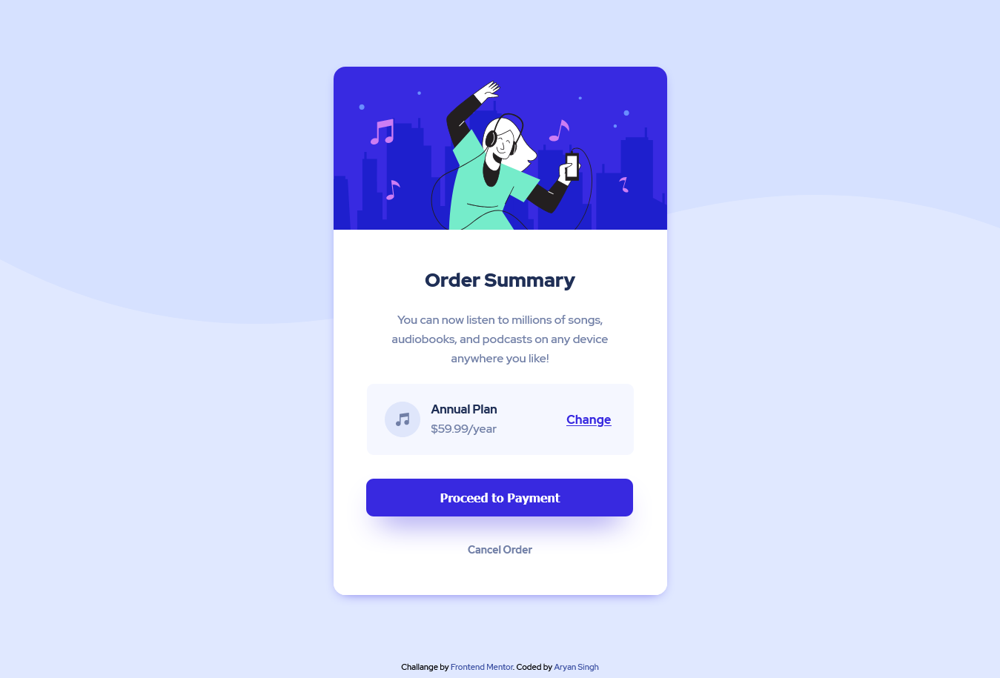

# Frontend Mentor - Order summary card solution

This is my solution to the [Order summary card challenge on Frontend Mentor](https://www.frontendmentor.io/challenges/order-summary-component-QlPmajDUj).

## Table of contents

- [Overview](#overview)
  - [The challenge](#the-challenge)
  - [Screenshot](#screenshot)
  - [Links](#links)
- [My process](#my-process)
  - [Built with](#built-with)
  - [What I learned](#what-i-learned)
- [Author](#author)

## Overview

### The challenge

Users should be able to:
- See hover states for interactive elements

### Screenshot

### Links

- Solution URL: [Link to Solution](https://arrayan04.github.io/order-summary-card-solution/)
- Live Site URL: [Live Solution](https://arrayan04.github.io/order-summary-card-solution/)

## My process

I enojoyed doing the project though writing the CSS and matching it to the designs given took a lot of time. 
But figuring out GIT & GITHUB took sooo much more time than I thought it would. Hopefully it will be faster next time :) 

### Built with

- Semantic HTML5 markup
- CSS custom properties
- Flexbox 

### What I learned

- Basic stuff about HTML and CSS 

## Author

- Frontend Mentor - [@yourusername](https://www.frontendmentor.io/profile/yourusername)
